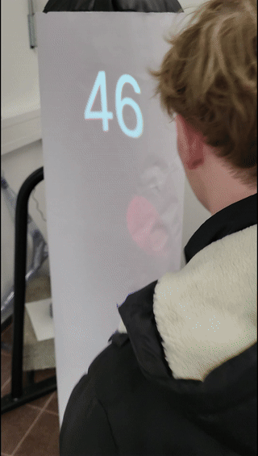
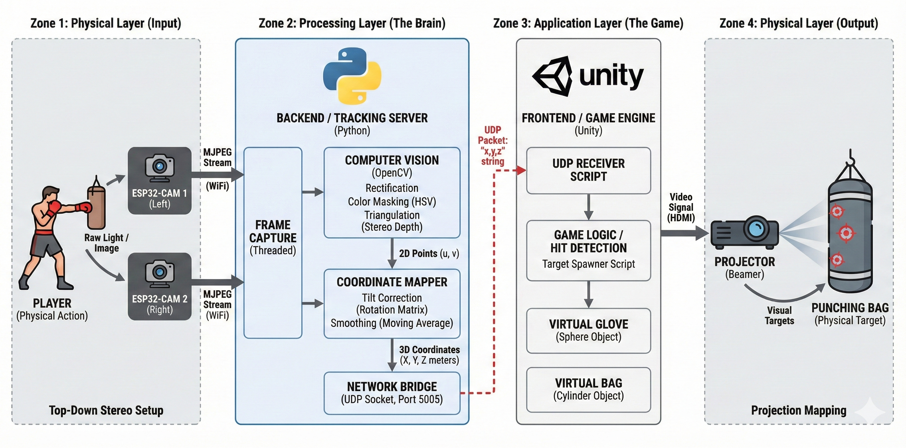

# Beat Boxing - Interactive Mixed-Reality Boxing Game 🥊

  
   
  <em>Figure 1: Player punching projected targets.</em>

**Beat Boxing** is an immersive game that blends physical exercise with digital gaming. Developed at **Hochschule Heilbronn** for the "Mixed Reality" lecture, this project transforms a standard punching bag into a smart, interactive gaming surface.

Inspired by *Beat Saber*, but designed for real-world impact, players use colored boxing gloves to punch projected targets. Unlike VR, where you strike thin air, **Beat Boxing** provides genuine haptic feedback against a physical heavy bag.

## 🏗️ System Architecture

The project operates as a closed-loop Mixed Reality system, divided into four distinct zones as illustrated below.

  
   
  <em>Figure 2: The data flow pipeline from physical input to visual output.</em>

### How the Data Flows:
1.  **Zone 1: Physical Input (The Eyes):** Two **ESP32-CAM** modules capture high-speed video of the player from a top-down perspective and stream it via MJPEG over WiFi.
2.  **Zone 2: Processing Layer (The Brain):** A **Python** backend receives the video feeds. It uses OpenCV to perform lens rectification, color masking (tracking the gloves), and stereoscopic triangulation to calculate real-time 3D coordinates ($X, Y, Z$).
3.  **Zone 3: Application Layer (The Game):** The 3D coordinates are sent via **UDP** to the **Unity Game Engine**. Unity maps the virtual gloves to the physical space, spawns targets, and detects collisions.
4.  **Zone 4: Physical Output (The Display):** A projector, connected to the PC via HDMI, maps the game visuals onto the curved surface of the punching bag. The player sees the targets on the bag and feels the impact when they punch.

## 📂 Project Structure & Modules

This repository is organized into three main sub-projects. Please refer to their specific READMEs for detailed technical documentation.

| Module | Technology | Description | Documentation |
| :--- | :--- | :--- | :--- |
| **Firmware** | C++ / PlatformIO | Firmware for the ESP32-CAM modules. Handles WiFi connection and MJPEG streaming with dynamic settings. | [View README](https://github.com/BeatBoxingProject/BeatBoxingESP32/blob/master/README.md) |
| **Backend** | Python / OpenCV | The computer vision brain. Handles stereo calibration, color tracking, triangulation, and UDP broadcasting. | [View README](https://github.com/BeatBoxingProject/BeatBoxingCameraTracking/blob/master/README.md) |
| **Frontend** | Unity / C# | The visual game engine. Handles projection mapping, hit detection, particle effects, and UI. | [View README](https://github.com/BeatBoxingProject/BeatBoxingUnity/blob/master/README.md) |

## 🚀 Getting Started

To run the full system, you will need to set up the three modules in the following order:

### 1. Firmware Setup 📸
Flash the ESP32-CAMs with the custom firmware to establish video streams.
* 👉 **Go to:** [`BeatBoxingEsp32`](https://github.com/BeatBoxingProject/BeatBoxingESP32) for flashing instructions and WiFi configuration.

### 2. Backend Setup 🧠
Install the Python environment, calibrate your cameras, and tune the glove color tracking.
* 👉 **Go to:** [`BeatBoxingCameraTracking`](https://github.com/BeatBoxingProject/BeatBoxingCameraTracking) for dependency installation, stereo calibration, and color tuning steps.

### 3. Game Setup 🎮
Open the project in Unity, align the virtual projector, and start the game loop.
* 👉 **Go to:** [`BeatBoxingUnity`](https://github.com/BeatBoxingProject/BeatBoxingUnity) for scene setup, projector alignment, and gameplay instructions.

### 📝 Credits
**University:** Hochschule Heilbronn (HHN) 
**Course:** Mixed Reality (SEM) 
**Team:**
* [NDXIII](https://github.com/NDXIII)
* [Kartoffelbauer](https://github.com/Kartoffelbauer)
